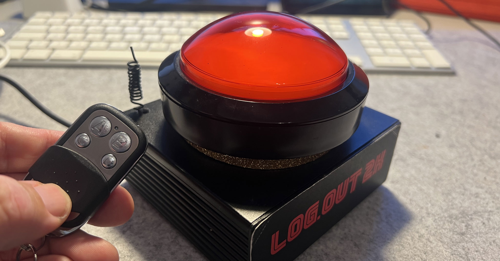

# Teensy_Big_Windows_Lock_Button

Forgot to lock the screen again? I built a big buzzer for it, so that I can quickly lock the computer even after getting up. My colleagues know this part. Unfortunately, I forget it despite the monster every now and then. That's why it now got a wireless upgrade. Not only can the screen be locked wirelessly, but the additional buttons on the remote control can also be used to turn the micro and the camera on and off.

